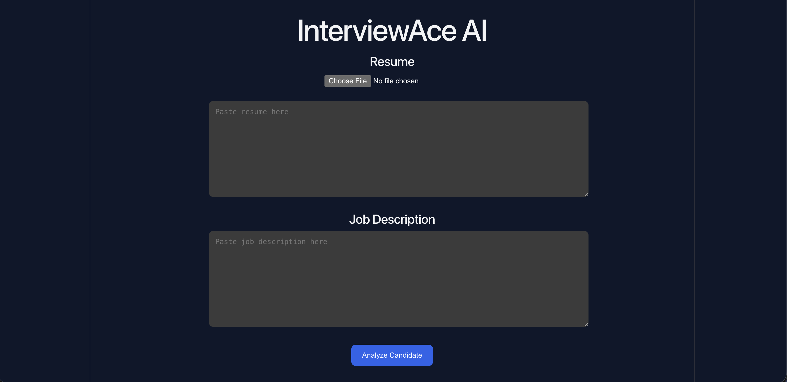
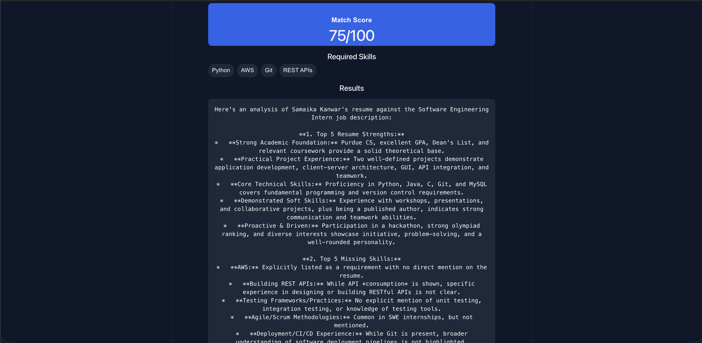

# InterviewAce AI

AI-powered interview preparation platform that analyzes a candidate's resume against a job description and generates:

- Resume match score
- Strengths analysis
- Missing skills detection
- Interview questions
- Improvement suggestions
- Downloadable PDF report

## Live Backend

Backend deployed on Render:

https://interviewace-ai-n056.onrender.com

## Features

- Upload resume PDF
- Paste job description
- AI-powered resume analysis
- Match score calculation
- Skill badge detection
- Interview question generation
- PDF report export

## Tech Stack

Frontend:
- React
- Vite
- JavaScript

Backend:
- Flask
- Google Gemini API
- PyPDF

## Screenshots

### Home Screen


### Analysis Results


## Run Locally

### Backend

```bash
cd backend
pip install -r requirements.txt
python app.py